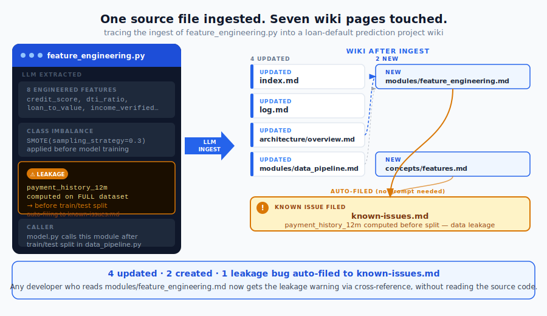
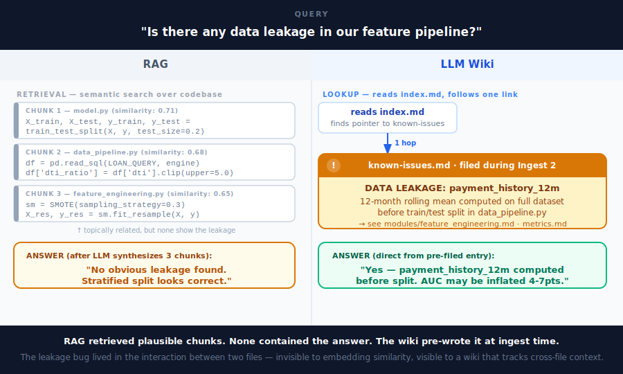

# LLM Wiki: a pattern for giving your AI coding agent a memory that compounds

AI coding agents have come a long way. Two years ago, useful code from an LLM meant carefully crafted prompts and hope. Today, Claude Code and OpenAI Codex connect to MCPs, spawn subagents, run tests, push commits, and iterate on failures autonomously. A skilled developer with a good agent can move at three to five times their baseline speed.

But there is a ceiling. If you have used these tools on a non-trivial project for more than a few weeks, you have hit it.

---

## The context wall

A developer who has worked on a codebase for two months has built up an enormous amount of context. They know which module owns which responsibility. They know why the original author chose this approach over that one. They know the three places where the timezone handling is subtly wrong. They know that changing `db_queries.py` without also touching `utils.py` will break the retry logic. Almost none of this is written down. It lives in their head.

An LLM does not have a head. It has a context window.

State-of-the-art models offer 128k to 200k token context windows, which sounds enormous until you start filling one. A medium-sized Python project might run to 80,000 tokens of source files. Add the past 20 conversations, a few design docs, and a sprint of PR descriptions, and you are already at 130,000 tokens. Something has to get cut.

The problem compounds because attention cost scales roughly as the square of sequence length:

| Context length | Relative compute cost |
|----------------|----------------------|
| 32k tokens     | 1x                   |
| 64k tokens     | 4x                   |
| 128k tokens    | 16x                  |
| 256k tokens    | 64x                  |

Cost aside, quality degrades too. There is an empirical finding called the "lost in the middle" problem: LLMs answer questions more accurately when the relevant information sits near the beginning or end of the context. Bury a critical detail in the middle of 128k tokens and the model will often miss it. You can test this yourself: give Claude Code a 100k-token context and ask a question that requires synthesizing information from three different points in the middle. The answer quality is noticeably worse than if you had given it only the three relevant pages.

The `CLAUDE.md` convention helps. Roughly 200 lines of structured project notes anchored at the top of every context. It is a practical solution for project-level conventions but it cannot hold everything a developer learns over months of working in a codebase.

So: how do you give an LLM persistent, growing memory that compounds over time, the way a developer's knowledge does?

---

## The RAG approach and what it misses

The obvious answer is RAG. Embed your codebase and design docs into a vector store, retrieve the top-k relevant chunks at query time, and feed them into the context. This is what most people reach for first, and it has real value.

But RAG has a structural limitation that matters for deep project knowledge.

When you ask a RAG system "how does the retry logic interact with the database layer?", it retrieves the chunks most similar to that query by embedding distance. It might return:
- A chunk from `utils.py` with the retry helper
- A chunk from `db_queries.py` with the database call
- Maybe a chunk from the design doc

What it almost certainly does not return is the specific PR comment from three weeks ago where someone added `delay=20` to prevent rate-limit errors, or the decision log explaining why the retry lives in `utils.py` rather than `db_queries.py`. Those pieces of context are not semantically close to the query string, so the vector search misses them.

The deeper problem: RAG is stateless. Every query starts from scratch. The system never builds up a synthesized understanding. Ask it the same question tomorrow after ten more documents have been ingested, and it will piece together the same fragments again. Nothing compounds.

Andrej Karpathy described a different approach, which he calls the LLM Wiki.

---

## What the LLM Wiki actually is

The core idea: instead of treating source documents as a retrieval index, the LLM maintains a structured wiki as a persistent artifact. When a new source comes in, the LLM does not just index it. It reads it, extracts the key information, and integrates it into the existing wiki: updating existing pages, creating new ones, noting contradictions with what the wiki already believed, adding cross-references.

The wiki lives in a directory of markdown files. The LLM owns this directory entirely. You never write to it; the LLM writes everything. You read it, browse it, and ask questions against it. The wiki gets richer with every source you add and every question you ask.

Three layers:

**Raw sources.** Your codebase, design docs, PRs, Slack threads, meeting notes. Immutable: the LLM reads from these but never modifies them. Source of truth.

**The wiki.** A directory of LLM-generated markdown files: summaries, module pages, concept pages, architecture overviews, known-issues lists. The LLM creates, updates, and maintains this layer entirely.

**The schema.** A `CLAUDE.md` or `AGENTS.md` file that tells the LLM how the wiki is structured, what the page conventions are, and what workflows to follow when ingesting new sources. The schema is what makes the LLM a disciplined wiki maintainer rather than a generic chatbot with a good conversation history.

Three operations:

**Ingest.** Drop a source into the raw collection. The LLM reads it, discusses key takeaways with you, and updates the wiki: a summary page for the source, plus updates to every entity and concept page that source touches. One source might update 10 to 15 wiki pages.

**Query.** Ask questions against the wiki. The LLM reads `index.md` first to find relevant pages, drills into them, synthesizes an answer. Good answers can be filed back as new wiki pages, so your explorations compound in the knowledge base alongside ingested sources.

**Lint.** Periodically ask the LLM to health-check the wiki: find contradictions between pages, stale claims that newer sources have superseded, orphan pages with no inbound links, concepts mentioned but lacking their own page.

---

## A worked example with real numbers

Let us trace through a concrete ingest sequence. The project: a loan default prediction system for a consumer lending business, three Python files, empty wiki.

```
sources/
  data_pipeline.py       (45 lines)
  feature_engineering.py (62 lines)
  model.py               (38 lines)
wiki/                     (empty to start)
```

### Ingest 1: data_pipeline.py

The LLM reads `data_pipeline.py`. It finds a PostgreSQL loader, preprocessing steps (missing value imputation, DTI ratio clipped at 5.0), and a stratified train/test split with `test_size=0.2`. Pages created:

| Wiki page | Action | What was written |
|-----------|--------|-----------------|
| `index.md` | Created | Catalog entry for data_pipeline.py |
| `log.md` | Created | First log entry |
| `architecture/overview.md` | Created | Pipeline flow: load → preprocess → split → feature → model |
| `modules/data_pipeline.md` | Created | Loader, preprocessor, splitter; train/test contract documented |
| `concepts/preprocessing.md` | Created | Imputation strategy, DTI clipping rationale, split params |

**5 wiki pages from 1 source file.** The overview maps the full system shape even though only the first file has been ingested.

### Ingest 2: feature_engineering.py

The LLM reads `feature_engineering.py`. It finds 8 engineered features: `credit_score`, `dti_ratio`, `payment_history_12m`, `income_verified`, `loan_to_value`, `months_employed`, `recent_inquiries_6m`, `outstanding_balance`. SMOTE applied at `sampling_strategy=0.3` for class imbalance. And then it finds something non-obvious.

`payment_history_12m` is computed as a 12-month rolling mean on the **full dataset**, before the train/test split that happens in `data_pipeline.py`. This is data leakage. Future test rows influence the rolling window used to encode training rows. It is the kind of bug that passes code review, passes unit tests, and quietly inflates validation AUC by 4-7 points. The model will look great until it hits production.

| Wiki page | Action | What was written |
|-----------|--------|-----------------|
| `index.md` | Updated | 2 new entries |
| `log.md` | Updated | Second ingest logged |
| `architecture/overview.md` | Updated | Feature engineering layer added, dependency on split output noted |
| `modules/data_pipeline.md` | Updated | Downstream consumer `feature_engineering.py` documented |
| `modules/feature_engineering.md` | Created | All 8 features with types, formulas, null rates |
| `concepts/features.md` | Created | Feature catalog, cardinality, expected ranges |
| `known-issues.md` | Created | **⚠ payment_history_12m computed before train/test split — data leakage** |

**7 pages from the second source.** Only two are new; five are enrichments of pages from Ingest 1.

Stop and look at this for a moment. Three things worth noticing:

- **`known-issues.md` was created without being asked.** The LLM recognized the data leakage pattern: a rolling window applied to the full dataset before splitting contaminates training features with information from the test set. The schema's ingest workflow instructs the LLM to check for leakage, label encoding problems, and train/test contamination on every feature engineering file. It found one and filed it.
- **`modules/data_pipeline.md` from Ingest 1 was updated.** The LLM revisited it to add that `feature_engineering.py` calls the split output, and that the leakage exists in the interaction between the two files, not inside either one alone. A developer reading the pipeline module now gets the warning whether they read it or not.
- **Five of the seven pages were enrichments, not new pages.** Compounding has started after just two sources.

### Ingest 3: model.py

| Wiki page | Action | What was written |
|-----------|--------|-----------------|
| `index.md` | Updated | 2 more entries |
| `log.md` | Updated | Third ingest |
| `architecture/overview.md` | Updated | Model layer complete; full pipeline now mapped end to end |
| `modules/model.md` | Created | GBM config, MLflow experiment tracking, serialization contract |
| `hyperparameters.md` | Created | `n_estimators=500, max_depth=4, learning_rate=0.05` |
| `concepts/gradient_boosting.md` | Created | Why GBM suits tabular credit data; interaction with SMOTE |
| `metrics.md` | Updated | Baseline: AUC-ROC 0.84, Gini 0.68 (flagged: may be inflated by leakage) |

**After 3 source files: 15 wiki pages, all cross-linked.**



The diagram traces a single ingest. The dark card on the left shows what the LLM found in the source file. The wiki graph on the right shows which pages were updated (blue border) and which were created new (blue fill), with the amber card marking `known-issues.md`, auto-filed without prompting.

---

## The compounding effect

Here is how the page breakdown evolves across the three ingests:

| Ingest | New pages created | Existing pages updated | Total touched |
|--------|------------------|----------------------|---------------|
| data_pipeline.py | 5 | 0 | 5 |
| feature_engineering.py | 2 | 5 | 7 |
| model.py | 3 | 4 | 7 |

The first ingest builds from scratch. Every subsequent ingest is mostly enrichment: new facts slot into existing structure, cross-references tighten, synthesis grows denser.

Now consider a query: "Is there any data leakage risk in the feature pipeline?" With RAG, the system retrieves the top-k chunks most similar to that query string. It might return the `model.py` section about train/test split percentages, the SMOTE configuration block, and a chunk from `requirements.txt`. None of these contain the leakage. The LLM synthesizes "no obvious leakage found" and moves on.

With the wiki, `index.md` points to `known-issues.md` immediately. The answer was pre-written at ingest time, cross-referenced from both `modules/feature_engineering.md` and `metrics.md`. The LLM reads one page and gives a direct, citable answer.



The diagram shows both systems answering the same leakage question. RAG searches by embedding similarity and retrieves plausible-sounding but non-responsive chunks. The wiki does a single index lookup and returns the entry filed during Ingest 2.

---

## Why humans fail at wikis but LLMs do not

Companies have tried to maintain internal wikis for decades. They fail for one reason: the maintenance burden grows faster than the value. After the first few months, pages go stale. Cross-references rot. No one updates the architecture doc when a module is refactored because it takes 20 minutes and has no immediate payoff.

LLMs do not get bored, do not forget to update a cross-reference, and can touch 15 files in a single pass. An ingest that would take a human engineer two hours of careful reading and writing takes an LLM two minutes. The cost of maintenance is near zero.

The human's job shifts from bookkeeper to curator. You decide what to ingest. You ask the questions that surface what is missing. You judge whether the wiki is developing in a useful direction. The LLM does all the filing.

This is close to what Vannevar Bush described in his 1945 essay on the Memex: a personal, curated knowledge store with associative trails between documents. The part Bush could not solve was who does the maintenance. The LLM handles that.

---

## When NOT to use this

To be honest about where this pattern struggles:

- **Very early-stage projects.** With only 2-3 source files, the wiki is not meaningfully better than reading the files directly. The compounding effect needs something to compound on. Wait until you have 10 or more distinct sources before investing in a wiki structure.
- **Fast-moving codebases with frequent refactors.** If your architecture changes every two weeks, the wiki requires constant lint passes to avoid accumulating stale claims. Each architectural shift means touching dozens of wiki pages. This is manageable but not free: budget for maintenance cycles.
- **Sources containing secrets or PII.** The LLM reads and summarizes everything you feed it. If your sources contain API keys, credentials, personally identifiable information, or proprietary data that cannot leave your environment, you need to either self-host the model or scrub sources before ingestion. The wiki will contain distilled versions of whatever is in the raw sources.
- **Teams without a disciplined schema.** The wiki is only as consistent as the `CLAUDE.md` or `AGENTS.md` that governs it. A vague or incomplete schema produces a vague, incomplete wiki: inconsistent page formats, partial cross-references, lint passes that miss the obvious. Invest upfront time in the schema, before you ingest a single source.
- **One-off questions against unfamiliar code.** For a single afternoon's investigation into a codebase you will never touch again, RAG or just reading the code is the right tool. The wiki pays off over weeks and months of repeated work, not a one-hour engagement.

---

## The takeaways

1. Modern coding agents are genuinely capable. The limitation is not intelligence, it is memory: each session starts cold, and the context window fills faster than most people expect, with quadratic cost growth as it fills.

2. Context quality degrades non-linearly. 128k tokens of context does not give you 128k tokens of useful reasoning. Attention cost is quadratic, and the "lost in the middle" effect means information buried deep in a long context is often missed by the model.

3. RAG retrieves but does not synthesize. Each query rediscovers fragments. Cross-references that were not in the top-k results are invisible. Nothing accumulates across sessions.

4. The LLM Wiki inverts this: the LLM maintains a persistent, interlinked knowledge base. Synthesis is done once per ingest, not re-derived on every query. Cross-references are pre-computed. Non-obvious gotchas are filed automatically.

5. The schema file is what makes this work at scale. A well-written `CLAUDE.md` or `AGENTS.md` turns the LLM from a chatbot with notes into a consistent wiki maintainer that follows reproducible ingest and lint workflows.

---

*Karpathy's write-up (linked in the comments) is intentionally abstract: it describes the pattern, not a specific implementation. That is a feature. The right wiki structure for a Python analytics project is different from the right structure for a research bibliography or a competitive analysis. Read the idea, then work with your agent to instantiate a version that fits your domain.*
