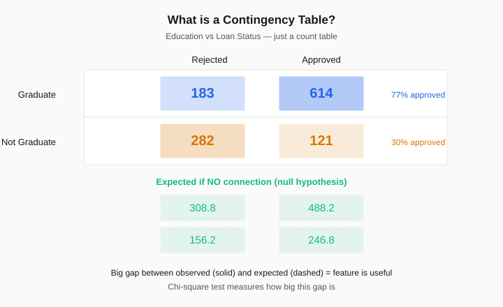
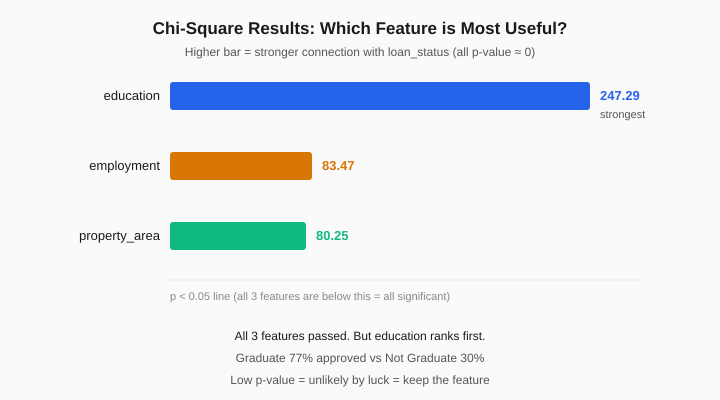

# Chi-Square Test for Feature Selection: Simple Guide with Loan Data

You have many categorical columns in your dataset.

Employment. Education. City type.

Should you encode all of them before training a model?

Maybe not.

Some columns may have no link to your target.

They only add noise.

This article explains a simple test called **chi-square test**.

We use a loan dataset (1,200 rows) with 3 categorical features and a binary target (loan approved or rejected).

---

## Why do we need this test?

When you build an ML model, you get many string columns.

If you one-hot encode everything, your data becomes wide and slow.

Worse, weak features enter the model and hurt performance.

You need a quick way to ask: **does this column actually relate to the target?**

Chi-square test answers that before you train anything.

---

## What is a contingency table?

A **contingency table** is just a count table.

Nothing fancy.

You pick one feature (say, education).

You pick the target (loan approved = 1, rejected = 0).

Then you count how many people fall in each box.

Example for education:

| Education | Rejected | Approved | Total |
|-----------|----------|----------|-------|
| Graduate | 183 | 614 | 797 |
| Not Graduate | 282 | 121 | 403 |
| **Total** | **465** | **735** | **1,200** |

Rows = categories of the feature.

Columns = target classes.

Each cell = how many rows have that combination.

**Why it matters:**

Look at approval rate.

Graduate: 614 approved out of 797 = **77%**

Not Graduate: 121 approved out of 403 = **30%**

That is a big gap.

If both groups had ~61% approval (the overall rate), education would not matter much.

But they do not.

So education looks useful even before any formal test.



---

## What is the chi-square test?

Chi-square test checks one simple question:

**Are the feature and target connected, or are they independent?**

Independent means knowing the feature tells you nothing about the target.

Connected means it tells you something.

The test compares two things:

1. **Observed counts** = what you actually see in your data
2. **Expected counts** = what you would see if there was no connection at all

If observed and expected are very close, the feature is probably useless.

If they are far apart, the feature is probably useful.

---

## What is the null hypothesis?

Every statistical test starts with a **null hypothesis**.

For chi-square, the null hypothesis (H₀) says:

> The feature and the target are **independent**. There is no connection.

The **alternative hypothesis** (H₁) says:

> They are **not independent**. There is a connection.

The test tries to reject the null hypothesis.

If we can reject it, we say the feature is statistically significant.

If we cannot reject it, the feature may not help the model.

Simple rule: we are trying to prove the null hypothesis is wrong.

---

## How do we get expected counts?

If education and loan status were truly independent, we would expect each cell to follow this formula:

```
Expected = (row total × column total) / grand total
```

For Graduate + Rejected:

```
(797 × 465) / 1200 = 308.8
```

We expected ~309 rejections among graduates if there was no link.

We actually saw **183**.

That is a big difference.

Full expected table:

| Education | Rejected (expected) | Approved (expected) |
|-----------|--------------------|--------------------|
| Graduate | 308.8 | 488.2 |
| Not Graduate | 156.2 | 246.8 |

Compare with observed:

| Education | Rejected (observed) | Approved (observed) |
|-----------|--------------------|--------------------|
| Graduate | 183 | 614 |
| Not Graduate | 282 | 121 |

Graduates got approved much more than expected.

Non-graduates got rejected much more than expected.

That gap is what chi-square measures.

---

## How is the chi-square statistic calculated?

For each cell:

```
(Observed - Expected)² / Expected
```

Add all cells together. That sum is the **chi-square statistic (χ²)**.

| Cell | Observed | Expected | (O-E)²/E |
|------|----------|----------|----------|
| Grad, Rejected | 183 | 308.8 | 51.1 |
| Grad, Approved | 614 | 488.2 | 32.3 |
| Not Grad, Rejected | 282 | 156.2 | 101.3 |
| Not Grad, Approved | 121 | 246.8 | 64.2 |
| **Total χ²** | | | **~248.9** |

SciPy gives **247.29** (small rounding difference).

Bigger χ² = bigger gap between observed and expected = stronger connection.

---

## What is the p-value?

After calculating χ², you get a **p-value**.

**Simple meaning of p-value:**

If there is really no connection between feature and target, what is the chance of seeing a gap this big just by luck?

- **Low p-value** (below 0.05) = very unlikely by luck → feature is likely useful
- **High p-value** (above 0.05) = could easily happen by luck → feature may not help

We usually use **0.05** as the cutoff.

p < 0.05 → significant → keep the feature

p ≥ 0.05 → not significant → consider dropping the feature

For education: p ≈ 0.000000. Way below 0.05. Very significant.

---

## Stop and look at this

1. Not Graduate / Rejected contributed the most (101.3). Many more non-graduates were rejected than we would expect by chance.
2. Graduate / Approved also beat expected (614 vs 488.2).
3. The approval rate gap is huge: 77% vs 30%. This is not a borderline result.
4. Significant does not always mean big practical effect. Here, both are true.

---

## Results for all 3 features

We ran the same test on employment, education, and property_area.

| Feature | χ² | p-value | Significant? |
|---------|-----|---------|-------------|
| education | 247.29 | 0.000000 | Yes |
| employment | 83.47 | 0.000000 | Yes |
| property_area | 80.25 | 0.000000 | Yes |

All 3 passed.

But **education** has the highest χ².

That means strongest connection with loan status.



**Approval rates by category:**

| Feature | Category | Approval rate |
|---------|----------|---------------|
| education | Graduate | 77.0% |
| education | Not Graduate | 30.0% |
| employment | Employed | 66.2% |
| employment | Self-Employed | 64.3% |
| employment | Unemployed | 23.8% |
| property_area | Urban | 77.4% |
| property_area | Semiurban | 52.0% |
| property_area | Rural | 51.0% |

Overall approval rate: **61.3%**

---

## Why use chi-square in ML?

1. **Fast.** No model training. Runs in milliseconds.
2. **Simple.** Easy to explain to teammates and managers.
3. **Works on categorical data.** No need to encode first.
4. **Gives a shortlist.** Keep significant features, drop weak ones.
5. **Ranks features.** Higher χ² = stronger connection. Not just yes/no.

---

## When NOT to use chi-square

- **Continuous features** (age, income): use a different test, or bin the column first.
- **Very small data**: if expected count in any cell is below 5, results may be unreliable.
- **Many features at once**: testing 100 features at 0.05 level can give false positives. Use correction methods.
- **Causation**: significant feature does not mean it causes the target. It may just be correlated.
- **Tree models**: XGBoost and Random Forest can find splits without this pre-step. Chi-square is most useful before linear models or neural nets.

---

## Key takeaways

1. **Contingency table** = count table of feature categories vs target classes.
2. **Null hypothesis** = feature and target have no connection.
3. **Chi-square** = measures how far observed counts are from expected counts.
4. **p-value** = chance of seeing this gap by luck. Low p = useful feature.
5. On loan data, all 3 features are significant. Education is the strongest.

---

**Notebook:** `chi_square_feature_selection_loan_applications.ipynb` has full code, plots, and step-by-step output.
