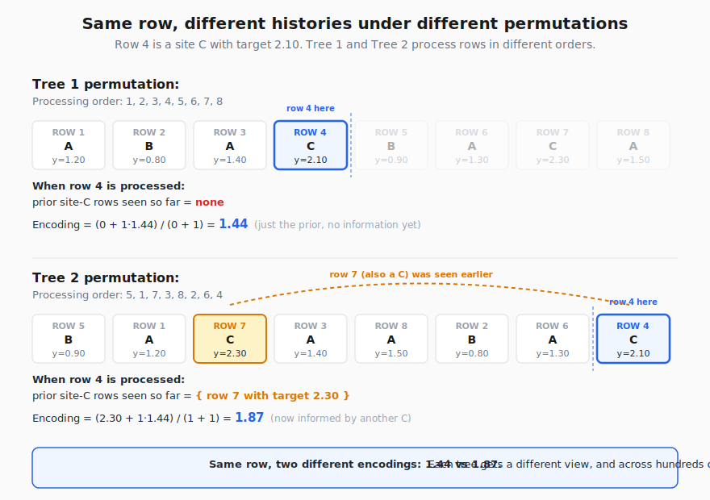
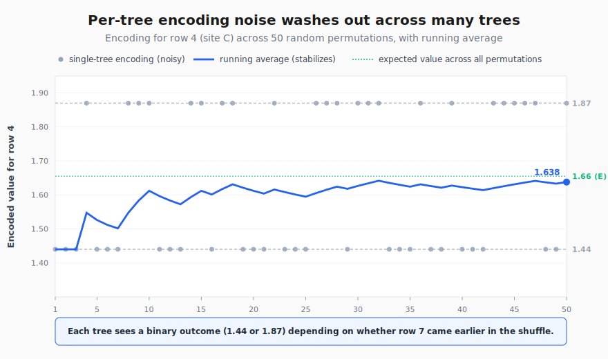

# Why CatBoost Wins on High-Cardinality Categories: A Hands-On Walkthrough of Ordered Target Encoding

If you have ever tried to fit a model on adtech data, you have run into this problem. You have 50,000 placement IDs, 200,000 advertiser IDs, and a target like win price or click probability. You know the categories carry signal. You also know that one-hot encoding 50,000 columns is going to break something.

This article walks through how CatBoost handles categorical features differently from XGBoost and LightGBM, focuses on the actual arithmetic of **ordered target encoding** across multiple trees, and shows why it pairs especially well with the kind of high-cardinality data you find in ad exchanges, recommender systems, and large e-commerce catalogs.

The math is simple. The intuition is the part that takes a moment to click. We will build it slowly with a small worked example.

---

## A quick tour of categorical encoding

Before we get to the CatBoost-specific part, let us make sure we are on the same page about what encoding even means. A tree-based model needs numbers. Categorical features ("site_id = bigrecipe.com", "device = mobile") are not numbers. We need a way to turn them into numbers without throwing away the signal they carry.

There are four common approaches.

### 1. One-hot encoding

For a categorical feature with `k` distinct values, you create `k` new binary columns, one per value. Row gets a 1 in the column matching its category and 0s everywhere else.

```
site_id = "A"   ->   [site_A=1, site_B=0, site_C=0]
site_id = "B"   ->   [site_A=0, site_B=1, site_C=0]
```

**Works well when:** `k` is small (under maybe 50). Country codes, device types, browser families.

**Breaks when:** `k` is large. With 50,000 placement IDs, you just added 50,000 columns to your training data. Memory blows up. Trees take forever to find splits because each split is a single-column binary check. And most of those columns have almost no rows with a 1 in them, so the model cannot learn from them.

### 2. Label encoding

Each category gets a unique integer.

```
site_A -> 0
site_B -> 1
site_C -> 2
```

**Works well when:** the category is genuinely ordinal (low / medium / high), or when used with tree models that handle the integer as just another number.

**Breaks when:** the integer is arbitrary (which is almost always). The model now thinks `site_C` (2) is somehow "greater than" `site_A` (0). Trees will split on that fake ordering and pick up noise. Linear models fail completely.

### 3. Frequency encoding

Replace each category with the count or proportion of times it appears in the training data.

```
site_A appears 4 times -> 4 (or 4/8 = 0.5)
site_B appears 2 times -> 2
site_C appears 2 times -> 2
```

**Works well when:** popularity itself is informative. A heavily trafficked site behaves differently from a rare one, and that difference correlates with the target.

**Breaks when:** popularity does not actually carry the signal you care about. Two sites can have the same traffic but very different win prices. Frequency tells the model nothing about *that* distinction.

### 4. Target encoding (the naive version)

Replace each category with the mean target value for that category.

```
site_A target_mean = 1.35  -> 1.35
site_B target_mean = 0.85  -> 0.85
site_C target_mean = 2.20  -> 2.20
```

**This is genuinely powerful.** It compresses the entire category-target relationship into a single informative number. High-cardinality features become tractable because each category becomes one number, not one column.

**The big problem:** target leakage. When you compute the mean for `site_A`, you include the current row's own target in the mean. The model effectively sees the answer during training. Training accuracy looks great. Test accuracy collapses.

This is the problem CatBoost was specifically built to solve.

---

## What CatBoost actually does: ordered target encoding

CatBoost's solution is clever in a deeply low-tech way. Here is the recipe.

**Step 1:** Take a random permutation of your training rows. Call this the "history order."

**Step 2:** For each row in the permutation, compute its encoding using only the rows that came **before it** in the permutation, restricted to the same category. Never use the row's own target.

**Step 3:** Smooth the result with a prior so the early rows of each category do not produce unstable values.

The formula is:

```
                 sum_of_target_for_prior_rows  +  a * P
encoded(row) =  ---------------------------------------
                    count_of_prior_rows  +  a
```

Where:
- `P` is a prior, usually the global mean of the target.
- `a` is a smoothing weight, usually a small number like 1.

That is the whole idea. The cleverness is in what it gives you:
1. **No leakage**, because no row sees its own target.
2. **A target-informed numeric value**, so high-cardinality categories collapse to one informative column.
3. **Variance that averages out across trees**, because CatBoost uses different permutations for different trees.

Point 3 is the one most people miss. Let us actually build the calculation.

---

## A worked example with real numbers

We will use a tiny adtech dataset. One categorical feature (`site_id`), one numerical feature (`hour_of_day`), and a regression target (`win_price`, the price the auction cleared at in dollars).

| Row | site_id | hour | win_price |
|-----|---------|------|-----------|
| 1   | A       | 9    | 1.20      |
| 2   | B       | 14   | 0.80      |
| 3   | A       | 10   | 1.40      |
| 4   | C       | 22   | 2.10      |
| 5   | B       | 15   | 0.90      |
| 6   | A       | 11   | 1.30      |
| 7   | C       | 23   | 2.30      |
| 8   | A       | 12   | 1.50      |

Global mean of `win_price` = (1.20 + 0.80 + 1.40 + 2.10 + 0.90 + 1.30 + 2.30 + 1.50) / 8 = **1.44** (rounded).

We will use prior `P = 1.44` and smoothing `a = 1`.

### Tree 1: encoding under permutation 1

Tree 1 uses the original row order as its permutation: (1, 2, 3, 4, 5, 6, 7, 8).

Walk through it row by row. For each row, look at all earlier rows in the permutation that share the same `site_id`, sum their targets, count them, and apply the formula.

| Row | site | Prior rows for this site | Sum of targets | Count | Encoded value |
|-----|------|--------------------------|----------------|-------|---------------|
| 1   | A    | none                     | 0              | 0     | (0 + 1.44) / (0 + 1) = **1.44** |
| 2   | B    | none                     | 0              | 0     | (0 + 1.44) / (0 + 1) = **1.44** |
| 3   | A    | {row 1: 1.20}            | 1.20           | 1     | (1.20 + 1.44) / (1 + 1) = **1.32** |
| 4   | C    | none                     | 0              | 0     | (0 + 1.44) / (0 + 1) = **1.44** |
| 5   | B    | {row 2: 0.80}            | 0.80           | 1     | (0.80 + 1.44) / (1 + 1) = **1.12** |
| 6   | A    | {1.20, 1.40}             | 2.60           | 2     | (2.60 + 1.44) / (2 + 1) = **1.347** |
| 7   | C    | {row 4: 2.10}            | 2.10           | 1     | (2.10 + 1.44) / (1 + 1) = **1.77** |
| 8   | A    | {1.20, 1.40, 1.30}       | 3.90           | 3     | (3.90 + 1.44) / (3 + 1) = **1.335** |

**The dataset Tree 1 actually trains on:**

| Row | site_enc (T1) | hour | win_price |
|-----|---------------|------|-----------|
| 1   | 1.44          | 9    | 1.20      |
| 2   | 1.44          | 14   | 0.80      |
| 3   | 1.32          | 10   | 1.40      |
| 4   | 1.44          | 22   | 2.10      |
| 5   | 1.12          | 15   | 0.90      |
| 6   | 1.347         | 11   | 1.30      |
| 7   | 1.77          | 23   | 2.30      |
| 8   | 1.335         | 12   | 1.50      |

Stop and look at this for a moment. A few things worth noticing:

- **Row 1, row 2, and row 4 all got the same encoded value (1.44)** because each was the first occurrence of its category. The encoding has no information yet, so the prior is all we can offer. This is fine. The tree will rely on `hour` for these rows.
- **Row 8 (site A) got 1.335**, which is close to the true mean of A's prior win prices (1.30). By the time we got to row 8, we had three earlier A observations to learn from.
- **Row 5 (site B) got 1.12**, which already captures that B is a low-win-price site even with only one prior observation.
- **Crucially, no row's encoding ever uses its own target.** Row 8's encoding uses targets from rows 1, 3, and 6, but not row 8's own 1.50.

That is one tree's view of the data. Now the magic.

### Tree 2: encoding under permutation 2

For Tree 2, CatBoost picks a **different random permutation** of the rows. Say the new processing order is (5, 1, 7, 3, 8, 2, 6, 4). We walk through the same calculation, but rows are now seen in a different order.

| Step | Original row | site | Prior rows for site (in this perm) | Sum | Count | Encoded |
|------|--------------|------|-----------------------------------|-----|-------|---------|
| 1st  | row 5        | B    | none                              | 0    | 0 | **1.44** |
| 2nd  | row 1        | A    | none                              | 0    | 0 | **1.44** |
| 3rd  | row 7        | C    | none                              | 0    | 0 | **1.44** |
| 4th  | row 3        | A    | {row 1: 1.20}                     | 1.20 | 1 | **1.32** |
| 5th  | row 8        | A    | {1.20, 1.40}                      | 2.60 | 2 | **1.347** |
| 6th  | row 2        | B    | {row 5: 0.90}                     | 0.90 | 1 | **1.17** |
| 7th  | row 6        | A    | {1.20, 1.40, 1.50}                | 4.10 | 3 | **1.385** |
| 8th  | row 4        | C    | {row 7: 2.30}                     | 2.30 | 1 | **1.87** |

Now realign the encoded values back to the original row order so we can compare:

| Row | site | Encoded T1 | Encoded T2 |
|-----|------|------------|------------|
| 1   | A    | 1.44       | 1.44       |
| 2   | B    | 1.44       | 1.17       |
| 3   | A    | 1.32       | 1.32       |
| 4   | C    | 1.44       | 1.87       |
| 5   | B    | 1.12       | 1.44       |
| 6   | A    | 1.347      | 1.385      |
| 7   | C    | 1.77       | 1.44       |
| 8   | A    | 1.335      | 1.347      |

**This is where ordered target encoding pays off.** Look at row 4 (site C, target 2.10).

In Tree 1, it got encoded as 1.44 (the prior, because it was the first C). The tree had to predict a 2.10 win price using only `hour=22` and a useless `site_enc=1.44`. It probably did badly on this row.

In Tree 2, the same row 4 got encoded as 1.87 because by then we had already seen row 7 (also a C, with a high win price). Now the tree has a much more informative number to work with.



The encoded values for the same row are **different across trees**. That is intentional. With one tree, the variance is high and you might get unlucky. With 100 trees using 100 different permutations, every row gets seen many times under different histories, and the noise cancels out while the actual category-target signal compounds.

This is also why CatBoost generally needs more trees to fully shine. Fifty trees may not be enough for the variance to wash out. A thousand trees usually is.

To make the variance-averaging concrete, here is what happens to row 4's encoding across 50 simulated trees with 50 different random permutations:



Each gray dot is row 4's encoding under one specific tree. Notice how the dots cluster at exactly two values: **1.44** (when row 7 happened to come after row 4 in that tree's permutation, so row 4 saw no prior C) and **1.87** (when row 7 happened to come before, so row 4 had one prior C to learn from). Each individual tree gives you a coin-flip outcome.

The blue line is the running average across trees. It starts noisy but stabilizes around the green dashed line, which marks the expected encoding value of 1.66 (the 50/50 mix of the two outcomes). After 50 trees we are at 1.638, very close to the expectation.

This is the variance averaging in action. **Single tree: high noise. Many trees: stable signal.** It is the same logic that makes ensembling work in general, applied at the encoding layer rather than the prediction layer.

---

## How XGBoost and LightGBM would handle the same problem

Same dataset, different tools.

### XGBoost

XGBoost (in its default mode) does not handle categorical features at all. You preprocess them yourself. Most people one-hot encode.

The training data XGBoost sees:

| Row | site_A | site_B | site_C | hour | win_price |
|-----|--------|--------|--------|------|-----------|
| 1   | 1      | 0      | 0      | 9    | 1.20      |
| 2   | 0      | 1      | 0      | 14   | 0.80      |
| ... | ...    | ...    | ...    | ...  | ...       |

For three sites, this is fine. For 50,000 placement IDs, you have 50,000 columns where almost every entry is zero. Memory explodes, training slows down dramatically, and trees waste time evaluating splits on near-empty columns.

XGBoost added some native categorical support in version 1.5+, but it uses **optimal split search**, not target statistics. It looks at all possible binary partitions of the category set and picks the best one for the current node. This is fast and clean for low-cardinality features. For 50,000 placements, even with the partition heuristic, you do not get the same per-row informativeness that target encoding gives you.

### LightGBM

LightGBM has clever native categorical support. At each split, it sorts categories by the ratio `sum_gradient / sum_hessian` and treats them as ordered. It then finds the best split point on that ordering. The math comes from a Fisher-style approach to optimal partitioning.

This is faster than CatBoost in many cases and works well on medium-cardinality features. But two limitations matter for adtech:

1. **It does not give you a numeric encoding you can split on alongside other features.** It is a per-split routine. The category does not become a meaningful number that a downstream tree can use in combination with other features.
2. **It uses all training data including the current row when computing those gradient sums** at each split. The leakage is structurally different from naive target encoding (the gradients are smaller signals than raw targets), but on tiny datasets or very high-cardinality features it can still overfit.

For 50,000 placement IDs with strong target signal, CatBoost's approach of "give every row a real, leakage-free, target-informed number" tends to extract more signal per tree.

---

## Why this matters specifically for adtech and high-cardinality features

In adtech the same handful of feature types come up over and over:

- **placement_id** (50,000+ values)
- **advertiser_id** (200,000+ values)
- **creative_id** (millions of values)
- **publisher_id, site_id, app_bundle_id**
- **geo, device_model, browser_version**

Every one of these is high-cardinality, and every one of them carries strong target signal. A specific advertiser bids consistently aggressive prices. A specific creative converts at 3x the average. A specific placement clears at 5x the floor.

If you one-hot encode this, your feature matrix is mostly zeros and your trees cannot find good splits. If you label encode it, you introduce a fake ordering. If you frequency encode it, you lose the target connection.

Ordered target encoding is the one approach that:

1. **Scales to millions of categories** because each one becomes a single number.
2. **Preserves target signal** without leakage.
3. **Plays well with the rest of your features.** The encoding is just another numeric column. Trees can split on it the same way they split on `hour_of_day` or `bid_floor`.

This is why CatBoost tends to be the default choice in production adtech ML systems with high-cardinality features.

---

## When NOT to use CatBoost

To be honest about it:

- **Small datasets.** If a category has only a handful of rows, the running mean is too noisy. The prior dominates and you lose the advantage. Manual encoding with hand-picked rare-category bucketing often beats CatBoost on tiny data.
- **Mostly low-cardinality features.** If your categoricals are all under 50 distinct values, LightGBM with native cat support is usually faster and equally accurate.
- **You need very fast inference.** CatBoost is generally slower at inference than LightGBM.
- **You cannot afford many trees.** Ordered TS shines with 500+ trees. If your latency budget caps you at 50 trees, the variance does not have time to wash out.

---

## The takeaways

1. **One-hot encoding breaks at high cardinality.** Label encoding invents fake orderings. Frequency encoding throws away target signal. Naive target encoding leaks.

2. **Ordered target encoding solves all four problems at once.** It compresses each category into one informative number, computed using only past rows in a random permutation. No leakage, full target signal.

3. **Multiple permutations across multiple trees** are what make this approach robust. The same row gets seen with different histories across different trees, and the encoding noise averages out while the signal compounds.

4. **For high-cardinality adtech features**, ordered target encoding is genuinely better than what XGBoost or LightGBM do natively, and the difference grows as cardinality grows.

5. **Use more trees than you would with XGBoost.** The variance averaging needs iterations to work. 1000+ trees is normal for CatBoost on high-cardinality data.

The math is just a running mean with smoothing. The cleverness is in what you do with it: shuffle, march through, and never look ahead.

---

*If this was useful, the same approach applies to Bayesian target encoding, M-estimate encoding, and James-Stein encoding. They are all variations on "how do we get target signal out of a category without leaking." CatBoost just happens to bake one specific variation into the training loop itself.*
